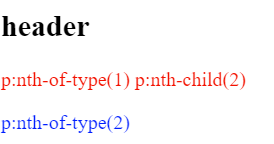

# Javascript

## 스크롤위치에 따라 class 추가하기

```
원하는 윈도우의 scrollY 값에 이를 때
DOM element에 class를 추가해 sticky 효과를 넣고 싶었고
다음 코드를 작성했다.
```

```js

const headerSticky = {
  target: document.querySelector(".header-wrap"),
  className: "sticky",
  position: 18,
};

const { target, className, position } = headerSticky;
const scrollHandler = () => {
  console.log("hi");
  if (window.scrollY > position) {
    target.classList.add(className);
  }
};
window.addEventListener("scroll", scrollHandler);
```
```
위 코드의 문제점은
class를 add한 후에도 계속해서 scrollHandler 함수를 실행한다는 것이다.

불필요한 함수 실행을 제거하기 위해 removeEventListener를 추가해보려했다.
```

### 첫 번째 시도

재사용을 고려해 코드를 짜봤다.

```
addEventListener의 인자로 전달되는 handler함수 내에서, 
handler함수가 자기 자신의 함수를 window에서 remove하게끔 작성했지만 동작하지 않았다.
이유는 function을 bind하는 순간 새로운 function을 전달하기 때문이었다.

      add(func1)
      remove(func1.bind(null, func1, params)에서, 
      bind에 의해 remove로 새로운 function이 전달된다.

```

```js

const headerSticky = {
  target: document.querySelector(".header-wrap"),
  className: "sticky",
  position: 18,
};

const addClassOnScrollYHandler = (removedHandler, parameters) => {
  const { target, className, position } = parameters;
  console.log("hi");

  if (window.scrollY > position) {
    target.classList.add(className);
    window.removeEventListener("scroll", removedHandler);
  }
};

function addClassOnScrollY(handlerFunc, parameters) {
  window.addEventListener(
    "scroll",
    handlerFunc.bind(null, handlerFunc, parameters)
    // bind할 경우, 새로운 함수가 되므로 remove에서 제거되지 않는다.
  );
}

addClassOnScrollY(addClassOnScrollYHandler, headerSticky);

```

### 두 번째 시도

```
구성자 함수를 통해 handler함수를 메소드로 정의했다. 
인스턴스가 생성될 경우 곧바로 eventListener를 추가하고 
scroll 위치에 이르는 순간 class를 제거하고 곧바로 window에서 인스턴스의 handler 메소드를 삭제한다.
재사용이 가능하며 listener가 역할을 마친 후 제거되어 불필요한 handler 함수 실행이 없어졌다.
```


```js

const headerSticky = {
  target: document.querySelector(".header-wrap"),
  className: "sticky",
  position: 18,
};
const projectTitleSticky = {
  target: document.querySelector(".projects__title"),
  className: "sticky",
  position: 30,
};

function AddClassOnScrollY(parameters) {
  this.handler = () => {
    const { target, className, position } = parameters;
    console.log("hi");
    if (window.scrollY > position) {
      target.classList.add(className);
      window.removeEventListener("scroll", this.handler);
    }
  };

  window.addEventListener("scroll", this.handler);
}
new AddClassOnScrollY(headerSticky);
new AddClassOnScrollY(projectTitleSticky);

```

# CSS

## 컴포넌트화를 고려할 떄의 유의점

애니메이션 효과가 있는 네비게이션을 만드는 과정에서 
네비게이션 컴포넌트를 코드펜에서 별도로 작성했다.

```html
<!-- nav.html -->
<ul>
  <li>list1</li>
  <li>list2</li>
  <li>list3</li>
</ul>

위와 같이 nav > li*3 구조로 작성하고 js/css파일을 작성해 렌더링 결과를 확인하고
main에서 이를 사용하려 하였는데...
```


```html
<!-- main.html -->
<ul class="footer__contact nav-slide">
        <button id="opener" class="nav-slide__opener nav-slide__item btn show">
          <p id="nav-about">About</p>
          <i class="fas fa-user-circle"></i>
        </button>
        <li><p>Chang Hyun</p></li>
        <li><i class="fas fa-paper-plane"></i></li>
        <li>
          <a
            target="_blank"
            href="https://github.com/ChangHyun2?tab=repositories"
            >
            <i class="fa fa-github"></i>
          </a>
        </li>
        <button id="closer" class="btn nav-slide__closer">
          <i class="far fa-times-circle"></i>
        </button>
</ul>
```

```
코드펜에서 작성해둔 nav 컴포넌트와는 다르게 li하위에 p, i, a와 같은 요소들이 위치해
js, css파일에서 돔 조작과 렌더링 모두 엉켜버렸고, 결국 대부분의 코드를 수정하게 되었다..

컴포넌트화를 할 경우 하위 컴포넌트의 형태를 고려해 설계하고 여러 하위 컴포넌트에 대응할 수 있게끔 구조화하는 것이 필요하다고 생각됐다.
```
  

## 이메일 전송 기능 추가하기
https://github.com/dwyl/learn-to-send-email-via-google-script-html-no-server

## 다시 사용할 것 같은 css 관련 기능
white-space : nowrap : 텍스트 줄바꿈 방지

### sticky animation 처리

상단 18px까지 스크롤할 경우 sticky 클래스를 추가해 
위에서 아래로 내려오는 효과를 줬다.
다른 방법을 찾아볼 것!

```css
.sticky {
  position: sticky;
  top: 0;
  animation: topToBottom linear;
  animation-duration: 2s;
}

@keyframes topToBottom {
  from {
    top: -18px;
  }
  to {
    top: 0px;
  }
}
```

### last-of-type과 last-of-child의 차이

<!-- https://css-tricks.com/the-difference-between-nth-child-and-nth-of-type/ -->

```html
<section>
  <h1>header</h1>
  <p>p:nth-of-type(1) p:nth-child(2)</p>
  <p>p:nth-of-type(2)</p>
</section>
```
```css
section p:nth-child(2){
  color:red;
}
section p:nth-of-type(2){
  color:blue;
}
```


```
위 코드의 실행 결과이다.

즉, type은 해당 타입 중의 n번째 요소를 스타일링하고
child는 해당 타입이면서 부모의 n번째 child인 요소를 스타일링한다.
```

### 버튼 꾸미기
```css

버튼의 border두께 변화에 따른 height/width 변화 대응
.btn{
  border:none;
}

/* 
.component.btn{
  border: 1px;
} */

.component:hover{ /* <component class="btn component"></component> */
  border: solid red 2px;
  padding: calc(2rem - 1px);
  /* padding: 2rem; */

state가 바뀌기 전의 border를 hover됐을 떄의 border와 일치시켜줘도 되지만
한 selector에서 처리하기 위해 padding에서 calc를 사용했다.

}


텍스트가 블락처리되는 현상 제거

      /* avoid text selected */
      -webkit-touch-callout: none; /* iOS Safari */
      -webkit-user-select: none; /* Safari */
      -khtml-user-select: none; /* Konqueror HTML */
      -moz-user-select: none; /* Old versions of Firefox */
      -ms-user-select: none; /* Internet Explorer/Edge */
      user-select: none;

버튼을 클릭할 경우 테두리가 두꺼워지는 효과 제거


```


## class를 toggle할 때 transition과 keyframe의 차이

```css
.toBlack {
  color: #000;
  animation: toBlack 3s;
}

@keyframes toBlack {
  0% {
    color: #fff;
  }
  30% {
    color: #fff;
  }
  100% {
    color: #000;
  }
}
keyframe을 포함하는 클래스를 DOMㅉ element에 add/remove할 경우
keyframe이 끝나지 않은 시점에서 클래스를 토글할 떄 기존의 keyframe효과가 남게 된다.

.toBlack {
    color: #000;
    transition: color #000 3s;
}
반면, transition은 클래스를 add/remove할 떄 즉각적으로 기존의 효과가 사라진다.

keyframe, transition의 차이를 찾아봤다.
/* https://www.kirupa.com/html5/css3_animations_vs_transitions.htm */

요약하면,
transition은 css property의 변화에 따라 적용되고,
keyframe은 별도의 triggering 없이 정의될 때 자동적으로 실행된다고 한다.

따라서 keyframe을 class로 추가할 경우 
class를 추가하는 순간 keyframe이 정의되어 실행되고
class를 제거해 css property를 바꾸더라도 이 트리거와는 무관하기 때문에 기존에 실행하던 animation을 끝까지 수행하게 된다.

```

## 