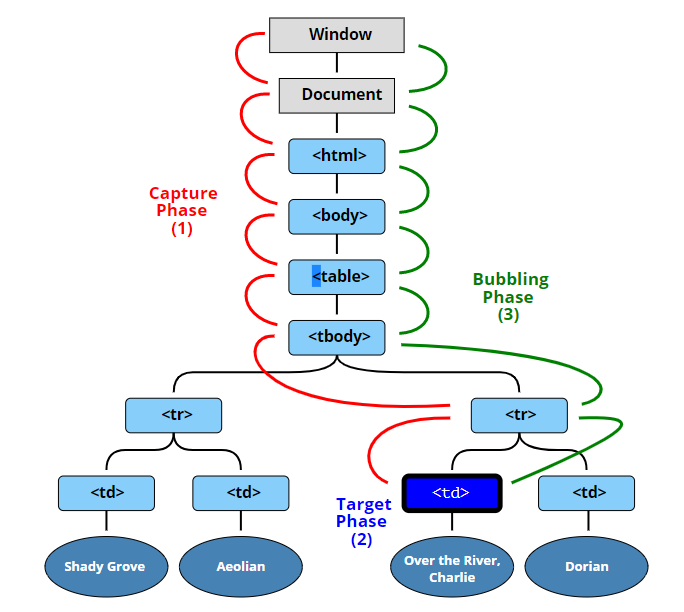

```html
<section>
    <div>
        <button>
```

버튼을 클릭할 경우,
3가지 phase에 걸쳐 동작

모든 element는 default로 모든 타입의 event listeners가 등록되어있음.
`eventTarget.addEventListener(eventType, eventHandler)` 메소드는 `EventTarget`(element)에 등록되어있는 `EventListener`(event listeners)에, handler함수를 등록하는 메소드임.

default setting에서, capturing phase에서의 handler함수 실행은 발생하지 않음.
즉, capturing phase에서 window로부터 event를 target까지 전달은 하지만, handler함수를 실행하지는 않음.

위의 이유로, 별도의 옵션 설정이 없을 경우 addEventListener의 evnetHandler실행은 bubbling phase에서 발생.

## event firing(propagation) phase

1. capturing phase

outside to inside

`    window부터 button element에 도달할 때까지의 모든 element에 대해 event를 전달하고 전달된 event에 대한 event handler가 있을 경우, 이를 실행 
`
2. target phase

reach to the target

`   event를 init한 target에 도착할 경우, bubbling phase로 넘어감.
`

3. bubbling phase

inside to outside

`   target element부터 전달받은 event를 상위 element로 전달하고 event handler가 있을 경우, 이를 실행
`    

from https://javascript.info/bubbling-and-capturing

## capturing/bubbling & event propagation

```js
const div = document.querySelector('div');
const btn = document.querySelector('button');

1. capturing phase에서 eventHandler 실행하기

div.addEventListener('click', e=>{
    console.log(e.target);
}, true); // capturing 단계에서 eventHandler가 실행됨.


2. bubbling 억제하기 ( stop propagation )

document.querySelector("div").addEventListener("click", (e) => {
  console.log("clicked div");
  console.log(e.target);
});

document.querySelector("button").addEventListener("click", (e) => {
  console.log("clicked button");
  console.log(e.target);
  e.stopPropagation();
});


3. capturing 동작 & propagatin 방지

아래와 같이 코드를 작성할 경우, 
div는 capturing phase에서 실행되고 
btn은 bubbling phase에서 실행된 후 propagation을 prevent하게 된다.

document.querySelector("div").addEventListener("click", (e) => {
  console.log("clicked div");
  console.log(e.target);
}, true);

document.querySelector("button").addEventListener("click", (e) => {
  console.log("clicked button");
  console.log(e.target);
  e.stopPropagation();
});


```

## event delegation

event bubbling을 활용한 기법으로,
eventHandler를 상위 element에 등록해두고 
event.target을 컨트롤하는 기법.

```js
<ul>
    <li>
        <p>
        <p>
    <li>
    <li>


ul.addEventListener('click', (e)=>{
    console.log('hello' + e.target);
};
```
ul내에 위치한 li 또는 p를 클릭할 경우, event.Target에서부터 bubbling이 발생하는데, 
이 때 bubbling에 의해 상위에 위치한 ul까지 click event가 전달됨. 
ul에 click event가 전달될 경우 등록해둔 click eventHandler가 실행됨.


## event.currentTarget & event.target

event.target : event가 발생한 실제 타겟
event.currentTarget : eventHandler를 실행한 listener가 붙어있는 타겟

이벤트 위임을 할 경우,
eventHandler를 등록한 element가 currentTarget이 됨.

## triggering DOM elements Programatically.