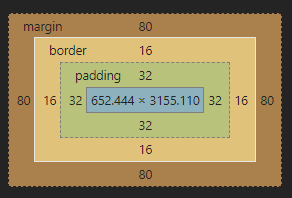

    
## content-box & border-box


## getboundingClientRect()
 
element : border-box (content + padding + border)


### 코드 구현 
```js
window.addEventListener("scroll", (e) => {
  console.log(document.body.getBoundingClientRect());
});

DOMRect {
    
    x: 80
    y: -2492.444580078125
    right: 828.4444580078125
    bottom: 758.66650390625

left: 80
top: -2492.444580078125
height: 3251.111083984375
width: 748.4444580078125
__proto__: DOMRect

}
```


viewport를 기준으로 element가 위치한 x(left), y(top), right, bottom위치를 계산하며, viewPort의 scrolling값이 감해져서 계산된다.

따라서, 만약 document의 좌상단 꼭짓점으로부터의 x, y, right, bottom을 알고싶을 경우 scrolling position(window.scrollX, window.scrollY)을 더해주면 된다.

height/width : border-box의 높이 너비

document.documentElement.clientHeight = viewport height
