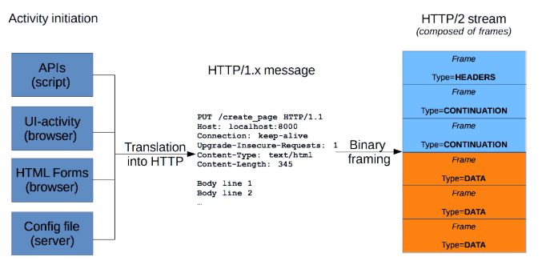
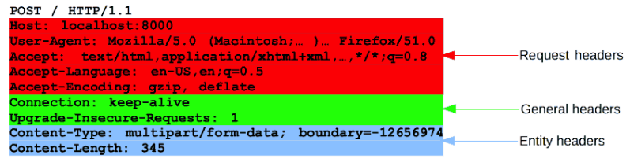
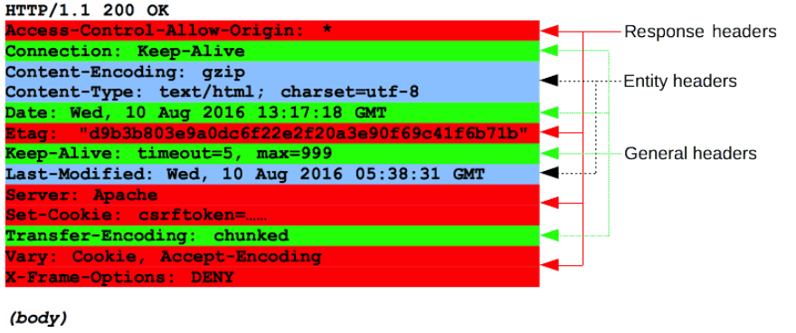

<!-- HTTP messages? -->
# HTTP messages
HTTP messages : server와 client 간에 어떻게 데이터가 교환되는지

크게 2가지로 분류
1. request : client가 server에 action을 trigger함.
2. response : server로부터 응답을 받음.

HTTP messages는
아스키로 인코딩된 내용으로 구성됨.

HTTP 버전
1. HTTP/1.1
2. HTTP/2
    - frame 단위로 데이터 전송
    - 데이터 전송 방식의 변화로 성능 향상

web server가 APIs, interfaces, config files를 통해 
HTTP 메세지를 만들어 전송하는데,

필요에 따라 웹 개발자가
직접 HTTP 메세지를 작성해 전송함.
서버와 클라이언트 간의 통신에 직접적으로 관여하는 셈



from MDN

script
    - APIs
browser
    - UI-activity
    - HTML Forms
server
    - config file

위 내용을 정의하는 코드가 실행되면
HTTP message가 생성되고
이 메세지를 binary frame으로 쪼개어 송신함
이렇게 쪼개진 frames를 HTTP/2 stream이라고 함

<!-- HTTP Request Message -->
# HTTP Requests

1. 첫 줄 : request METHOD / response status
2. optional Header : 요청에 대한 명세 body 내용 설명
3. 빈 줄 : request가 보낸 모든 meta정보
4. optional body : request와 관련된 data (content of an HTML form , response와 관련된 document) body의 존재 유무와 size가 첫 줄과 헤더에 명시됨.

## 1. First Line (항상 한 줄로 구성)

First Line = `HTTP method` `request target` `HTTP version`

### 1) `HTTP method` : 어떤 액션을 취할 것인가?
   - Verb
     - GET
     - POST
     - PUT
   - Noun
     - HEAD
     - OPTIONS

- GET : resource를 fetch할 거야
- POST : data를 server에 올릴 거야(create/modify resource or generate temporary document to send back)


### 2) `request target` : 일반적으로 URL, absolute path (프로토콜/포트/도메인)

- absolute path (origin form)
```
POST / HTTP/1.1                             /
GET /background.png HTTP/1.0                /background.png
HEAD /test.html?query=alibaba HTTP/1.1      /test.html?query=alibaba
OPTIONS /anypage.html HTTP/1.0              /anypage.html
```

- complete URL (absolute form)
```
GET http://developer.mozilla.org/en-US/docs/Web/HTTP/Messages HTTP/1.1
```

- URL 권한 (authority form)
```
도메인 이름:포트
CONNECT naver.com:80 HTTP/1.1
```

### 3) `HTTP 버전`

## 2. Headers



1) Request headers
   - User-Agent
   - Accept-Type
   - Referer
2) General headers
   - Via
3) Entity headers
   - Content-Length

외에도 다양한 정보를 입력

## 3. Body

resource를 fetch하는 GET, HEAD, DELETE, OPTIONS같은 METHOD에서는 필요하지 않고
data를 서버에 보내는 POST와 같은 method에서 사용됨

<!-- HTTP Response Message-->
# HTTP Responses



1. Status line
   - protocol version : HTTP/1.1
   - [status code](https://developer.mozilla.org/en-US/docs/Web/HTTP/Status) : 200, 404, 302, ...
   - status text : status code에 대한 설명
2. Headers
   - General headers
     - Via 
   - Response headers
     - Vary
     - Accept-Ranges
   - Entity headers
     - Content-Length
3. Body
    
    201 Created / 204 No Content처럼 전달할 내용이 없을 경우는 사용하지 않아

    resource의 개수와 header에 따라 크게 세 타입으로 분류

    1. single resource bodies
      - single file에 대한 내용 
      - header는 Content Type + Content Length로 구성
    2. single resource bodies
      - single file에 대한 내용 
      - header는 Transfer Encoding : chunked로 구성
    3. multiple resource bodies
      - 여러 개의 body를 가짐. 

